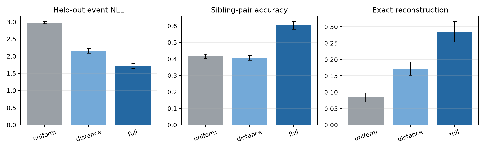
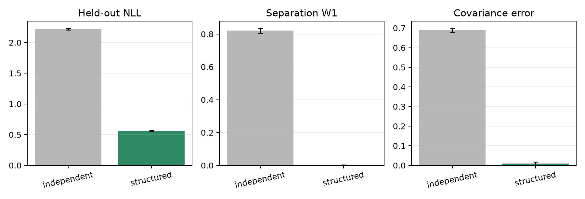
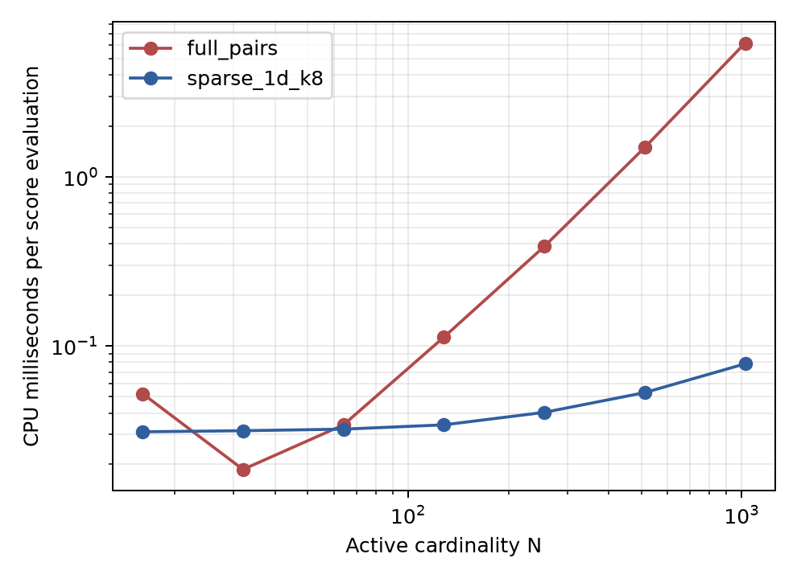

# CPU experimental report

## Scope

These experiments test the small-scale mechanisms that are meaningful on a
CPU. They do **not** compare against published neural baselines and do not
establish an ICML-level empirical result. All reported summary values use
5 independent seeds; error bars in the PNG figures are 95% t-intervals
over those seeds.

Runtime for the complete extended suite: **98.81 seconds**.

## 1. Learned reverse merge kernel

Synthetic parents were conservatively split into two children. A marked
softmax reverse kernel was trained on the resulting event histories. The
distance-only and full models use the same objective; the full model also has
mass-ratio, combined-mass, and centroid features.

| Model | Event NLL | Sibling accuracy | Exact reconstruction | Reconstruction error |
|---|---|---|---|---|
| uniform | 2.9830 | 0.4166 | 0.0840 | 0.7085 |
| distance_only | 2.1588 | 0.4071 | 0.1720 | 0.5718 |
| learned_full | 1.7164 | 0.6047 | 0.2855 | 0.4442 |

Interpretation: the trainable reverse likelihood can recover useful pairwise
coagulation structure and reconstruct conservative parents. This is evidence
for implementation viability, not evidence that a neural coagulation model
beats a strong generative baseline.

## 2. Independent birth versus structured coordinates

Both models have four fitted scalar parameters. The independent model fits
separate Gaussian marginals for the two insertions. The structured model fits
a Gaussian parent center and Gaussian log-separation and includes the exact
coordinate Jacobian in held-out likelihood.

| Model | Held-out NLL | Separation W1 | Covariance error | Energy distance |
|---|---|---|---|---|
| independent_birth | 2.2194 | 0.8210 | 0.6895 | 0.2334 |
| structured_coordinates | 0.5630 | 0.0019 | 0.0090 | 0.0028 |

Interpretation: on data generated by a shared-parent mechanism, the structured
coordinates are substantially better calibrated than independent insertion.
This is the expected positive-control result. Because the data intentionally
have this structure, it cannot establish an advantage on natural datasets.

## 3. Pair-scoring scaling

At N=1024, the one-dimensional k=8 sparse candidate rule was
**79.0x** faster than full pair enumeration in this microbenchmark.
The sparse rule is exact only when the relevant merge is inside its candidate
set; candidate recall must therefore be reported in a real experiment.

## Conclusions supported by the CPU experiments

- The event maps, Jacobians, probability-flux reversal, and point-process
  likelihood implementation pass the separate correctness suite.
- A tabular/parametric reverse merge model can be fitted from simulated
  corruption histories using the proposed marked-event objective.
- Structured parent/separation coordinates can outperform independent births
  on a controlled positive-control distribution.
- Sparse candidate pairs materially reduce CPU scoring time.

## Conclusions not yet supported

- superiority to Jump Diffusion, Existence-Field Diffusion, flow matching, or
  autoregressive set generation;
- improved likelihood or sample quality on a real scalar-weighted set domain;
- scalability of a neural set encoder;
- an ICML-strength empirical advantage of coagulation over a capacity-matched
  learned birth-only model.

Those remaining questions require implementation of substantial neural
baselines and are where GPU access becomes practically important.
